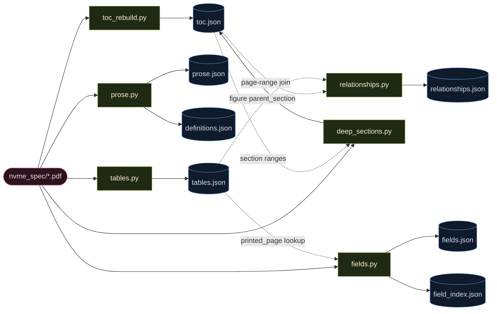
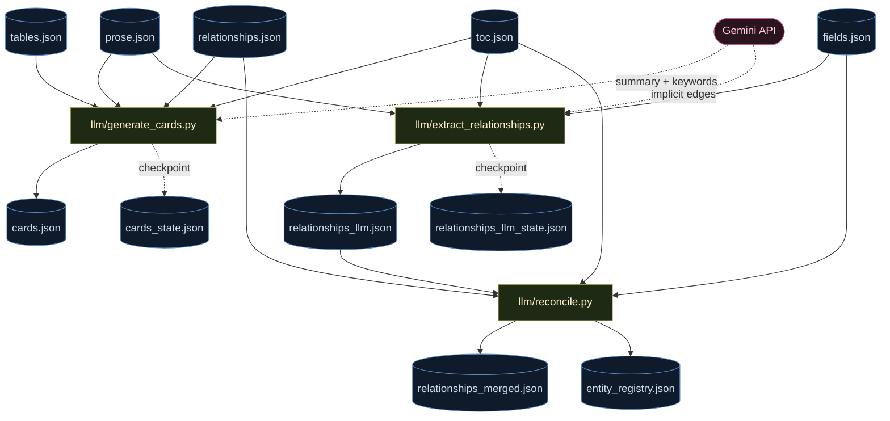
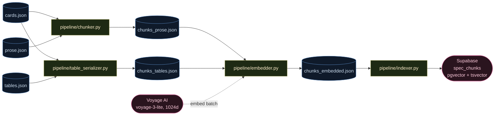
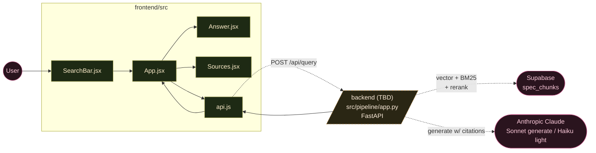

# specGPT Architecture

A code map of how raw NVMe PDF bytes become a queryable, cited answer.

The pipeline runs in two phases:

- **Phase 1** turns the PDF into a structured corpus (sections, tables, fields, definitions) and adds a semantic layer (LLM-summarized cards + a relationship graph).
- **Phase 2** chunks that corpus, embeds it, indexes it in Supabase, and (in progress) serves it through a small FastAPI backend to a React frontend.

Every JSON artifact lives in `data/`. Every Python module lives in `src/`. The frontend lives in `frontend/`.

---

## Phase 1A — PDF → structural artifacts (deterministic)

**What each module does:**

- `toc_rebuild.py` — pulls PyMuPDF's outline, normalizes section IDs, computes `printed_page` from `pdf_page - PAGE_OFFSET`. Initial pass.
- `prose.py` — walks every content page, recovers heading hierarchy from bold-line detection, slices body paragraphs by `[start, end)` page/y bounds. Side effect: extracts a `{term: definition}` map into `definitions.json`.
- `tables.py` — uses `page.find_tables()`, captures captions above each table, merges multi-page continuations, recursively flattens nested tables, keeps `raw_text` slice.
- `fields.py` — walks tables looking for bit/byte field tables, emits `(field, abbreviation, type, spec_page, ...)` records plus an abbreviation→record index.
- `deep_sections.py` — finds subsections too deep for the PDF outline (depth-4+), assigns each to a parent by page-range, **writes back into `toc.json`**.
- `relationships.py` — deterministic edges: figure→containing-section (page-range), section→child, plus regex-driven cross-references.

---

## Phase 1B — Structural artifacts → semantic layer (LLM)

**What each module does:**

- `llm/generate_cards.py` — one card per section. Most fields are deterministic (parent/child, tables, prose blocks, normative count). Only `summary` + `keywords` go to Gemini. Sections under `MIN_PROSE_CHARS` get a synthetic skeleton built from the title + child titles + table captions.
- `llm/extract_relationships.py` — reads each section's prose + a curated entity list, asks Gemini for implicit edges that the regex pass would miss (e.g. "Set Features uses Host Memory Buffer").
- `llm/reconcile.py` — normalizes entity names (strip articles, suffixes, parentheticals), snaps to canonical IDs (`section:<num>` validated against `toc.json`, `field:<abbrev>` validated against `fields.json`), merges deterministic + LLM edges, writes the canonical alias map.
- `llm/client.py` — shared Gemini client (`generate_json`) with retries.

---

## Phase 2A — Corpus → chunks → embeddings → index

**What each module does:**

- `pipeline/chunker.py` — flattens prose paragraphs into ~500-word overlapping chunks, prepends the section's card summary to every chunk so the embedding sees enough context, tracks which `pdf_pages` each chunk spans.
- `pipeline/table_serializer.py` — renders each table to plain text (`Figure N — caption`, headers, rows joined by `|`), prepends the card summary, one chunk per table.
- `pipeline/embedder.py` — batches all enriched chunks into Voyage AI (`voyage-3-lite`, 1024 dims, batch=128), enforces a per-run budget cap, writes vectors back onto each chunk record.
- `pipeline/indexer.py` — upserts each chunk into Supabase `spec_chunks` (vector + raw text + metadata: section_id, content_type, pdf_pages, has_normative, figure_number, etc.).

---

## Phase 2B — Runtime (frontend → backend → store)

**Status:** the frontend skeleton is wired to call `POST /api/query` and render `{answer, citations, confidence, sources[]}`. Vite dev server proxies `/api/*` to `localhost:8000`. The backend at `src/pipeline/app.py` does **not** exist yet — that's the next build step. It will own hybrid retrieval, optional graph expansion via `relationships_merged.json`, rerank, and Claude-generated answers with section-cited sources.

---

## Data artifact reference

| File | Producer | Consumers | What's inside |
|---|---|---|---|
| `toc.json` | `toc_rebuild.py` (+ `deep_sections.py`) | `relationships.py`, `generate_cards.py`, `extract_relationships.py`, `reconcile.py`, `deep_sections.py` | Section tree: `{section_number, title, level, target_page, pdf_page}`. Enriched in-place by `deep_sections`. |
| `prose.json` | `prose.py` | `generate_cards.py`, `extract_relationships.py`, `chunker.py` | One entry per section with paragraph list. Each paragraph carries text + page metadata. |
| `definitions.json` | `prose.py` | (future retrieval) | `{term: definition}` extracted from §1.6-style definition blocks. |
| `tables.json` | `tables.py` | `fields.py`, `relationships.py`, `generate_cards.py`, `table_serializer.py` | 717 figures with `caption`, `headers`, `rows`, `raw_text`, `printed_page`, `parent_section`. |
| `fields.json` | `fields.py` | `extract_relationships.py`, `reconcile.py` | 1,650 bit/byte field records w/ `spec_page`. |
| `field_index.json` | `fields.py` | (future retrieval, lookups) | Abbreviation → field record. |
| `relationships.json` | `relationships.py` | `generate_cards.py`, `reconcile.py` | Deterministic edges (regex + page-range). |
| `cards.json` | `llm/generate_cards.py` | `chunker.py`, `table_serializer.py` | 1,036 metadata cards w/ LLM `summary` + `keywords`. **Anchors every chunk's embedding context.** |
| `cards_state.json` | `llm/generate_cards.py` | itself (resume) | Checkpoint of which sections have been summarized. |
| `relationships_llm.json` | `llm/extract_relationships.py` | `reconcile.py` | Implicit edges Gemini surfaced. |
| `relationships_llm_state.json` | `llm/extract_relationships.py` | itself (resume) | Checkpoint. |
| `relationships_merged.json` | `llm/reconcile.py` | (future graph expansion in retrieval) | 7,706 unified, normalized edges. |
| `entity_registry.json` | `llm/reconcile.py` | (inspection / future canonicalization) | `{canonical: [aliases]}`. |
| `chunks_prose.json` | `pipeline/chunker.py` | `embedder.py` | ~1,188 prose chunks (~500 words, overlapping, summary-prefixed). |
| `chunks_tables.json` | `pipeline/table_serializer.py` | `embedder.py` | ~717 table chunks (serialized + summary-prefixed). |
| `chunks_embedded.json` | `pipeline/embedder.py` | `indexer.py` | Same chunks + `embedding: float[1024]`. |

---

## Notes / known wiring gaps

- **`pdf_page` vs `printed_page` on chunks.** `chunker.py:68` and `table_serializer.py:89` collect `pdf_page` from the source records, but human-facing citations want `printed_page` (= `pdf_page - PAGE_OFFSET`). Source records have both, so this is a one-line fix once citations matter.
- **`definitions.json` is parsed but unused.** No downstream consumer reads it yet. Likely lives as a definition-lookup tool the backend can call.
- **`relationships_merged.json` is built but unused.** Graph-expanded retrieval (per `BUILD_PLAN_FINAL.md`) is the natural consumer.
- **No backend exists yet.** `frontend/src/api.js` describes the contract it expects; building `src/pipeline/app.py` is the gating Phase 2 task.
